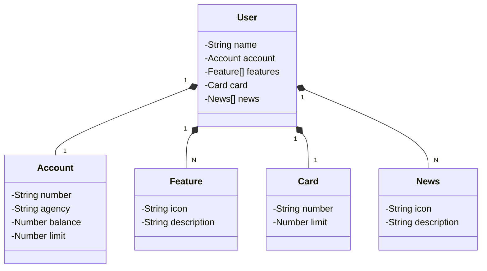

# Santander Dev Week 2023 Java API

RESTful API da Santander Dev Week 2023 construída em **Java 17** com **Spring Boot 3**.

---

## 🚀 Principais Tecnologias
- **Java 17**: versão LTS mais recente, robusta e estável.
- **Spring Boot 3**: framework que maximiza a produtividade com autoconfiguração.
- **Spring Data JPA**: simplifica o acesso a dados e integração com bancos SQL.
- **OpenAPI (Swagger)**: documentação interativa da API.
- **Railway**: deploy e monitoramento na nuvem, com suporte a bancos de dados e CI/CD.

---

## 🎨 [Link do Figma](https://www.figma.com/file/0ZsjwjsYlYd3timxqMWlbj/SANTANDER---Projeto-Web%2FMobile?type=design&node-id=1421%3A432&mode=design&t=6dPQuerScEQH0zAn-1)

O Figma foi utilizado para abstração do domínio da API, servindo como base para análise e projeto da solução.

---

## 📂 Diagrama de Classes (Domínio da API)



---

## 📖 Documentação da API (Swagger)

### Produção (Railway)
[https://sdw-2023-prd.up.railway.app/swagger-ui.html](https://sdw-2023-prd.up.railway.app/swagger-ui.html)

### Local
Após rodar a aplicação:
```
http://localhost:8080/swagger-ui.html
```

---

## ⚙️ Como executar localmente

### Usando Maven
```bash
mvn clean install
mvn spring-boot:run
```

### Usando Gradle
```bash
./gradlew bootRun
```

---

## 🔗 Endpoints principais
- `GET /users` → Lista todos os usuários  
- `GET /users/{id}` → Busca usuário por ID  
- `POST /users` → Cria novo usuário  
- `PUT /users/{id}` → Atualiza usuário existente  
- `DELETE /users/{id}` → Remove usuário  

---

## 🧩 Exemplo de requisição (POST /users)

```json
{
  "name": "Romário",
  "account": {
    "number": "02.123456-7",
    "agency": "2031",
    "balance": 500.00,
    "limit": 1500.00
  },
  "card": {
    "number": "xxxx xxxx xxxx 2222",
    "limit": 3000.00
  },
  "features": [
    { "icon": "pix", "description": "Pagamentos instantâneos" }
  ],
  "news": [
    { "icon": "invest", "description": "Novos fundos de investimento disponíveis" }
  ]
}
```

---

## 📌 Observações
- Porta padrão: **8080**  
- Para alterar a porta, edite `src/main/resources/application.properties`:
  ```
  server.port=8081
  ```

---

## 👨‍💻 Autor
Projeto desenvolvido durante a **Santander Dev Week 2023**.  
Customizado e rodado localmente por **Romário**
